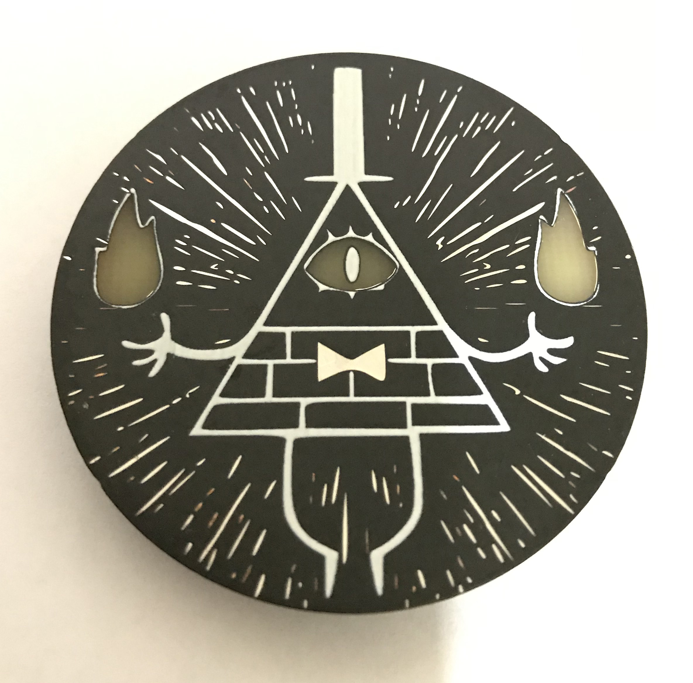
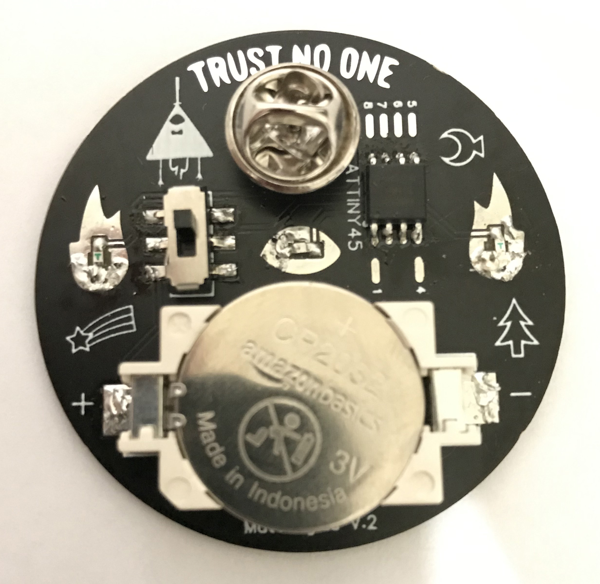
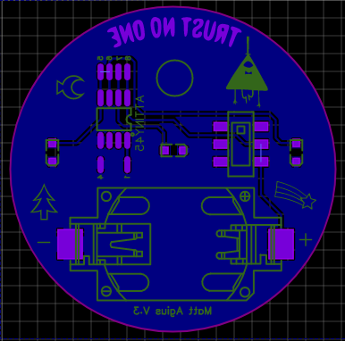

# Bill Cipher Badge

This is a [#badgelife](https://twitter.com/search?q=%23badgelife&src=typed_query) pin of everyone's favorite Eye of Providence, [Bill Cipher](https://gravityfalls.fandom.com/wiki/Bill_Cipher). This repo has the Arduino code, the PCB Gerber files, and a list of components needed to build this.

Please forgive my messy soldering work. When I made this my iron could not keep high temps.

## Components:
* PCB - Gerber files available in the `Berber_V3` folder, 1.6mm thick
* [ATTINY45](https://lcsc.com/product-detail/MICROCHIP_MICROCHIP_ATTINY45-20SU_ATTINY45-20SU_C62689.html)
* [Toggle Switch](https://lcsc.com/product-detail/Toggle-Switches_Korean-Hroparts-Elec-K3-2235S-F1_C223858.html)
* [CR2032 Battery Holder](https://lcsc.com/product-detail/Battery-Holders-Clips-Contacts_Q-J-CR2032-BS-6-1_C70377.html)
* [Red SMD LED](https://lcsc.com/product-detail/Light-Emitting-Diodes-LED_SMDLED-red_C181863.html)
* [2x Blue SMD LEDs](https://lcsc.com/product-detail/Light-Emitting-Diodes-LED_blue-SMDLED-45-55mcd_C89814.html)
* CR2032 3V Battery
* [Butterfly Clutch Tie Tacks Pin](https://www.amazon.com/gp/product/B06VXNN1HK/), a dab of super glue is used to attach the pin to the board